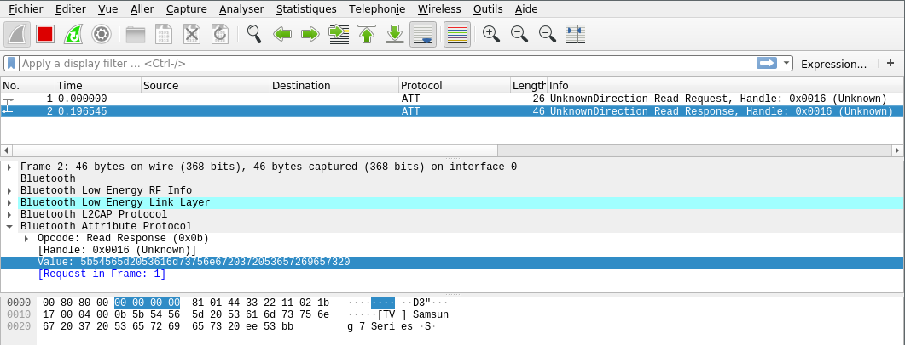

Bluetooth Low Energy GATT client
================================

``ble-central`` provides a scanner that can be used to detect surrounding BLE devices
as well as a GATT client allowing to connect to a remote BLE device and access
its services and characteristics. This tool must be used with a device supporting
the *Bluetooth Low Energy* domain.

.. contents:: Table of Contents
    :local:
    :depth: 1

Usage
-----

.. code-block:: text

    ble-central [OPTIONS] ([COMMAND] ([COMMAND ARGS]))

``ble-central`` accepts one or more options, and requires a valid command as its
first parameter. This command may or may not accepts arguments.

Command-line options
--------------------

**ble-central** supports the following options:

* ``--interface`` (``-i``): specifies the WHAD interface to use
* ``--bdaddr`` (``-b``): specifies a target Bluetooth Device address in the form *XX:XX:XX:XX:XX:XX*
* ``--file`` (``-f``): provides a script to execute
* ``--no-color``: disables colors in output

Supported commands
------------------

help
~~~~

.. code-block:: text

    $ ble-central help [command]

The ``help`` command provides useful help about any command implemented in ``ble-central``.

interactive
~~~~~~~~~~~

.. code-block:: text

    $ ble-central -i <interface> interactive

The ``interactive`` command provides an interactive shell allowing the user to
scan, connect and access a Bluetooth Low Energy device in an interactive way.

A WHAD interface name must be be provided through the ``--interface`` option for
this interactive shell to work properly. It will complain if you forget to provide
one. 

.. code-block:: text

    $ ble-central -i hci0 interactive
    ble-central>

More information about this interactive shell in the :ref:`dedicated section <central-interactive-shell>`.

profile
~~~~~~~

.. code-block:: text

    $ ble-central -i <interface> -b <bdaddress> scan

The ``profile`` command connects to a specific Bluetooth Low Energy device and queries its
services and characteristics. The ``--interface`` and ``--bdaddr`` options must be provided.

.. code-block:: text

    $ ble-central -i hci0 -b 00:11:22:33:44:55 profile
    Service Generic Attribute (0x1801) (handle 0x0001 to 0x0005)
      Service Changed (0x2A05) I, handle 0x0002, value handle 0x0003

    Service Generic Access (0x1800) (handle 0x0014 to 0x001e)
      Device Name (0x2A00) R, handle 0x0015, value handle 0x0016
      Appearance (0x2A01) R, handle 0x0017, value handle 0x0018

    Service ade3d529-c784-4f63-a987-eb69f70ee816 (handle 0x0028 to 0xffff)
      e9241982-4580-42c4-8831-95048216b256 RI, handle 0x0029, value handle 0x002a
      ad7b334f-4637-4b86-90b6-9d787f03d218 RW, handle 0x002b, value handle 0x002c
        Descriptor type 2902, handle 0x002d

scan
~~~~

.. code-block:: text

    $ ble-central -i <interface> scan

The ``scan`` command searches for surrounding BLE devices and displays them in
the output. An interface must be provided with the ``--interface`` option for
this command to work properly.

.. code-block:: text

    $ ble-central -i hci0 scan
     RSSI Lvl  Type  BD Address        Extra info
    [ -58 dBm] [PUB] d0:d0:03:77:53:28 
    [ -58 dBm] [PUB] d0:d0:03:77:53:28 name:"[TV] Samsung 7 Series (55)"

read
~~~~

.. code-block:: text

    $ ble-central -i <interface> -b <address> read [UUID | handle]

The ``read`` command connects to a specified BLE device and reads a given characteristic.
The parameter passed to this command may be a valid characteristic UUID or a GATT handle.

.. code-block:: text

    $ ble-central -i hci0 -b 00:11:22:33:44:55 read 81
    00000000: 22 76 65 72 22 3A 22 34  22                       "ver":"4"

write
~~~~~

.. code-block:: text

    $ ble-central -i <interface> -b <address> write [UUID | handle] [["hex"] VALUE]

The `write` command connects to a specified BLE device and writes a given characteristic
with a given value. Characteristic must be identified with its UUID or GATT handle. The
provided value can be a string or a HEX value.

.. code-block:: text

    $ble-central -i hci0 -b 00:11:22:33:44:55 write 42 "this is a test"
    $ble-central -i hci0 -b 00:11:22:33:44:55 read 42
    00000000: 74 68 69 73 20 69 73 20  61 20 74 65 73 74        this is a test

    $ble-central -i hci0 -b 00:11:22:33:44:55 write 42 hex 41 42 43
    $ble-central -i hci0 -b 00:11:22:33:44:55 read 42
    00000000: 41 42 43                                          ABC

writecmd
~~~~~~~~

.. code-block:: text

    $ ble-central -i <interface> -b <address> write [UUID | handle] [["hex"] VALUE]

The ``writecmd`` command is similar to the previous ``write`` command, accepts the
same parameters, but sens a GATT *WriteRequestWithNoResponse* instead of a *WriteRequest*.

This type of write operation does not cause the remote device to acknowledge that the
data has been correctly written.

Interactive shell
-----------------

.. _central-interactive-shell:

The interactive shell offers the possibility to dynamically interact with any device,
with an helpful interface that provides autocompletion. This interactive shell implements
all the commands supported by ``ble-central`` in non-interactive mode plus some extra
commands.

scan
~~~~

.. code-block:: text

    scan

Starts a scan that can be interrupted by a CTL-C. The discovered devices
are shown in the console as they are discovered.

.. code-block:: text

    ble-central> scan
     RSSI Lvl  Type  BD Address        Extra info
    [ -62 dBm] [PUB] d0:d0:03:77:53:28 
    [ -62 dBm] [PUB] d0:d0:03:77:53:28 name:"[TV] Samsung 7 Series (55)"
    Scan terminated by user

info
~~~~

.. code-block:: text

    info [NAME | BDADDR]

Shows detailed information about a previously discovered device. The
device *NAME* or BD address *BDADDR* must be provided as parameter.

.. code-block:: text

    ble-central> info d0:d0:03:77:53:28
    Device d0:d0:03:77:53:28
    RSSI:               -62 dBm
    Address type:       public

    Raw advertising records

      AD Record #0:
       02 01 0a

      AD Record #1:
       1b ff 75 00 42 04 01 20 76 19 0f 00 00 01 37 00
       00 00 00 00 00 00 00 00 00 00 00 00

devices
~~~~~~~

.. code-block:: text

    devices

Shows the previously discovered devices.

.. code-block:: text

    ble-central> devices
     RSSI Lvl  Type  BD Address        Extra info
    [ -62 dBm] [PUB] d0:d0:03:77:53:28 name:"[TV] Samsung 7 Series (55)"

connect
~~~~~~~

.. code-block:: text

    connect [NAME | BDADDR]

Initiates a GATT connection to the specified device identified by its *NAME* or
BD address *BDADDR*.

.. code-block:: text

    ble-central> connect d0:d0:03:77:53:28
    Successfully connected to target d0:d0:03:77:53:28

profile
~~~~~~~

.. code-block:: text

    profile

Searches the device services and characteristics and display its GATT profile.

.. code-block:: text

    ble-central|d0:d0:03:77:53:28> profile

    Service 1801

     2A05 handle: 2, value handle: 3
      | access rights: indicate

    Service 1800

     2A00 handle: 21, value handle: 22
      | access rights: read
     2A01 handle: 23, value handle: 24
      | access rights: read

    Service ade3d529-c784-4f63-a987-eb69f70ee816

     e9241982-4580-42c4-8831-95048216b256 handle: 41, value handle: 42
      | access rights: read, indicate
     ad7b334f-4637-4b86-90b6-9d787f03d218 handle: 43, value handle: 44
      | access rights: read, write

characteristics
~~~~~~~~~~~~~~~

.. code-block:: text

    characteristics

Shows the discovered characteristics.

.. code-block:: text

    ble-central|d0:d0:03:77:53:28> characteristics
     2A05 handle: 2, value handle: 3
      | access rights: indicate
     2A00 handle: 21, value handle: 22
      | access rights: read
     2A01 handle: 23, value handle: 24
      | access rights: read
     e9241982-4580-42c4-8831-95048216b256 handle: 41, value handle: 42
      | access rights: read, indicate
     ad7b334f-4637-4b86-90b6-9d787f03d218 handle: 43, value handle: 44
      | access rights: read, write

read
~~~~

.. code-block:: text

    read [UUID | HANDLE]

Reads a characteristic given its *UUID* or *HANDLE*.

.. code-block:: text

    ble-central|d0:d0:03:77:53:28> read 22
    00000000: 5B 54 56 5D 20 53 61 6D  73 75 6E 67 20 37 20 53  [TV] Samsung 7 S
    00000010: 65 72 69 65 73 20                                 eries 

write
~~~~~

.. code-block:: text

    write [UUID | HANDLE] [["hex"] VALUE]

Writes *VALUE* to the characteristic identified by its *UUID* or *HANDLE*. *VALUE*
must be provided in HEX if prefixed by *hex*.

.. code-block:: text

    ble-central|d0:d0:03:77:53:28> write 22 "This is a test"

sub
~~~

.. code-block:: text

    sub [UUID | HANDLE]

Subscribes to a characteristic identified by its *UUID* or *HANDLE*. Notifications
and indications will be notified in the console.

.. code-block:: text
    
    ble-central|d0:d0:03:77:53:28> sub 22
    

unsub
~~~~~

.. code-block:: text

    unsub [UUID | HANDLE]

Unsubscribes from a characteristic identified by its *UUID* or *HANDLE*.

.. code-block:: text
    
    ble-central|d0:d0:03:77:53:28> unsub 22

set
~~~

.. code-block:: text

    set [VAR] [VALUE]

Set the *VALUE* of variable *VAR*. *VALUE* can be any text or another value.
This value can be used in any command using *$VAR*.

.. code-block:: text

    ble-central> set TARGET d0:d0:03:77:53:28

env
~~~

.. code-block:: text

    env

Shows all the declared variables.

.. code-block:: text

    ble-central> env
    TARGET=d0:d0:03:77:53:28

unset
~~~~~

.. code-block:: text

    unset [VAR]

Unsets variable *VAR*. Once done, variable *VAR* does not exist anymore.

.. code-block:: text

    ble-central> unset TARGET

wireshark
~~~~~~~~~

.. code-block:: text

    wireshark [on | off]

Launches **Wireshark** and displays BLE packets in real-time or closes an existing
instance of **Wireshark**. This helps investigating GATT operations but also allows
saving capture packets as PCAP.

For instance, reading the characteristic with handle 22 of the currently connected
device while Wireshark is monitoring produces the following output in the interactive
shell:

.. code-block:: text

    ble-central|d0:d0:03:77:53:28> wireshark on
    ble-central|d0:d0:03:77:53:28> read 22
    00000000: 5B 54 56 5D 20 53 61 6D  73 75 6E 67 20 37 20 53  [TV] Samsung 7 S
    00000010: 65 72 69 65 73 20                                 eries 

And the following output in Wireshark:

Quick tutorial
--------------

Scanning for available devices
~~~~~~~~~~~~~~~~~~~~~~~~~~~~~~

`whad-central` is the CLI tool to use when dealing with BLE devices. This tool is able
to scan, connect to a device and access its characteristics. It supports any
HCI adapter (exposed as a virtual WHAD device) that may be present in your computer.

The following command looks for any available BLE devices in a terminal, providing detailed
information about each discovered device:

.. code-block::

    $ ble-central -i hci1 scan
     RSSI Lvl  Type  BD Address        Extra info
    [ -61 dBm] [PUB] d0:d0:03:77:53:28 
    [ -87 dBm] [PUB] 40:b3:14:04:b7:07 
    [ -87 dBm] [PUB] 40:b3:14:04:b7:07 name:"SomeDevice"

The RSSI (Received Signal Strength Indication) is displayed as well as the BD address
type (public or random), the BD address and some extra information extracted from
the advertising records. But it is possible to get more information using the interactive
mode of *ble-central*, with the *info* command as shown below:

.. code-block::

    $ ble-central -i hci1 interactive
    ble-central> scan
     RSSI Lvl  Type  BD Address        Extra info
    [ -62 dBm] [PUB] d0:d0:03:77:53:28 
    [ -92 dBm] [PUB] 40:b3:14:04:b7:07 
    Scan terminated by user
    ble-central> info 40:b3:14:04:b7:07
    Device 40:b3:14:04:b7:07
    RSSI:            -92 dBm
    Address type:    public

    Raw advertising records

    AD Record #0:
    02 01 02

    AD Record #1:
    11 07 75 5d 03 75 bb 43 a8 85 54 4e 3c 76 21 dd
    4e c7

    ble-central>

Connecting to a device and reading a characteristic
~~~~~~~~~~~~~~~~~~~~~~~~~~~~~~~~~~~~~~~~~~~~~~~~~~~

Using the interactive mode, we can connect to a device and searches its services
and characteristics using the **connect** and **profile** commands:

.. code-block:: text

    ble-central> connect 
    Successfully connected to target 40:b3:14:04:b7:07
    ble-central|40:b3:14:04:b7:07> profile
    Service 1801

    2A05 handle: 2, value handle: 3
    | access rights: indicate

    Service 1800

    2A00 handle: 21, value handle: 22
    | access rights: read
    2A01 handle: 23, value handle: 24
    | access rights: read
    2AA6 handle: 25, value handle: 26
    | access rights: read

Once connected, you can read any characteristic based on its value handle with
the *read* command, as shown below:

.. code-block:: text

    ble-central|40:b3:14:04:b7:07> read 22
    00000000: 53 6f 6d 65 44 65 76 69 63 65                  SomeDevice
